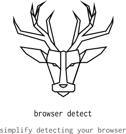

<p align="center" style="margin-bottom: 2em;"></p>

<p align="center"><a href="https://nodei.co/npm/metric-parser/"></a></p>

<p align="center">
    <a href="https://badge.fury.io/js/browser-detect"></a>
    <a href="https://www.npmjs.com/package/browser-detect"></a>
    <a href="https://gitter.im/KennethanCeyer/PIGNOSE?utm_source=badge&amp;utm_medium=badge&amp;utm_campaign=pr-badge&amp;utm_content=badge"></a>
    <a href="https://github.com/KennethanCeyer/browser-detect"></a>
    <a href="https://opensource.org/licenses/MIT"></a>
</p>

<p align="center">
    <a href="https://travis-ci.org/KennethanCeyer/browser-detect"></a>
    <a href="https://coveralls.io/github/KennethanCeyer/browser-detect?branch=master"></a>
    <a href="https://codecov.io/gh/KennethanCeyer/browser-detect"></a>
</p>

<p align="center">
    <a href="https://www.codefactor.io/repository/github/kennethanceyer/browser-detect"></a>
    <a href="https://codeclimate.com/github/KennethanCeyer/browser-detect/maintainability"></a>
    <a href="https://codeclimate.com/github/KennethanCeyer/browser-detect/test_coverage"></a>
    <a href="https://david-dm.org/KennethanCeyer/browser-detect"></a>
    <a href="https://david-dm.org/KennethanCeyer/browser-detect?type=dev"></a>
</p>

## Installation

#### npm

```bash
$ npm install browser-detect
```

#### yarn

```bash
$ yarn add browser-detect
```

#### zip

> [donwload zip link](https://github.com/KennethanCeyer/browser-detect/archive/master.zip)

----

## Example

### Web (without module)

1. Add following code in your `head` tag.

```html
<script src="node_modules/browser-detect/dist/browser-detect.umd.js"></script>
```

2. And follow this code to detect browser.

```javascript
const result = browserDetect();
console.log(result);
```

```javascript
{
    name: 'chrome',
    version: '58.0.3029',
    versionNumber: 58.03029,
    mobile: false,
    os: 'Windows NT 10.0'
}
```

### Web (with module)

```javascript
import browser from 'browser-detect';

const result = browser();
console.log(result);
```

### NodeJS

Just simple :trollface:

```javascript
const browser = require('browser-detect');
const result = browser();

console.log(result);
```

```javascript
{
    name: 'node',
    version: '9.9.0',
    versionNumber: 9.9,
    mobile: false,
    os: 'win32'
}
```

### NodeJS with Express

Using `req.headers` like following code.

```javascript
const router = express.Router();
const browser = require('browser-detect');

router.get('/', req => {
    const result = browser(req.headers['user-agent']);
    console.log(result);
});

return router;
```

```javascript
{
    name: 'ie',
    version: '9.0',
    versionNumber: 9,
    mobile: false,
    os: 'Windows NT 10.0'
}
```

Or set a middleware and send to `res.locals`.

```javascript
// browserDetectMiddleware.js
const browser = require('browser-detect');

const MiddleWare = () => req => {
    res.locals.browser = browser(req.headers['user-agent']);
    next();
};

module.exports = MiddleWare;
```

```javascript
// app.js

const express = require('express');
const browserDetectMiddleware = require('./browserDetectMiddleware');

const app = express();
app.use(browserDetectMiddleware())
```

View will can access `browser` variable.

```ejs
<!-- view.ejs -->

<%=JSON.stringify(browser)%>
```

```javascript
"{ name: 'firefox', version: '53.0.0', versionNumber: 53, mobile: false, os: 'Windows NT 10.0' }"
```

----

### Values

- **name**

  Name of browser such as `ie`, `chrome`, `firefox`.

- **version**

  Version of browser with comma (string).
 
- **versionNumber**

  Version of browser of which format is only number.
 
- **mobile**

  If browser is based mobile device it will be `true`, and if is not `false`.
 
- **os**

  User OS type such as `Windows NT 10.0`.

----

### Try with an example

**Client**

- Open `examples/client.html` by your browser.

**Server**

- Open command or terminal.
- Move directory to `browser-detect` path that you download.
- Type following code.

```bash
$ node ./examples/server.js
```

----

## Features

- Detect browser both compatible client and server.
- Support AMD and CommonJS module feature.

### Completed

- Support typings.
- Support guideline and documentations for contributors.
- Support browser compatity to IE7.
- Support to detect mobile and OS.
- Support Webpack2.x. (Including build process with reactjs or angular4.x)
- Support CI. (TravisCI)

----

### Plan for near *near*, **very near** future.

- Support TDD. (UnitTest, e2e Test)
- Suport CDN. (JSDelivr)

----

## Compatibility

### Test completed

- IE 7+
- Chrome (Windows, MacOS)
- Edge
- Firefox
- Safari (Windows, MacOS)
- Opera
- Android
- Chromium Browsers (Will be named chrome)

### Expected

- IOS
- Window phone (Edge)

----

## Contribution

**Setting environment for contribute**

1. Install project from GitHub
```bash
$ git clone git@github.com:KennethanCeyer/browser-detect.git
```
2. Install all modules from NPM
```bash
$ cd browser-detect
$ npm install
```
3. Install npx
```bash
$ npm install npx -g
```
4. Build sources
```bash
$ npm run build
```

**Testing**

1. run npm scripts
```bash
$ npm run test
```

2. if you need coverage report try as follows
```bash
$ npm run coverage
```

**Linting**
1. browser-detect is used tslint
```bash
$ npm run lint
```

----

## Contributors

- [ **vlewin**](https://github.com/vlewin)
  - fix pattern issue [#2](https://github.com/KennethanCeyer/browser-detect/issues/2)
  - add unit test with mocha + chai
 
----

## License

`browser-detect` is under MIT license

of cource, You can use it, modify it and contribute it :trollface:
